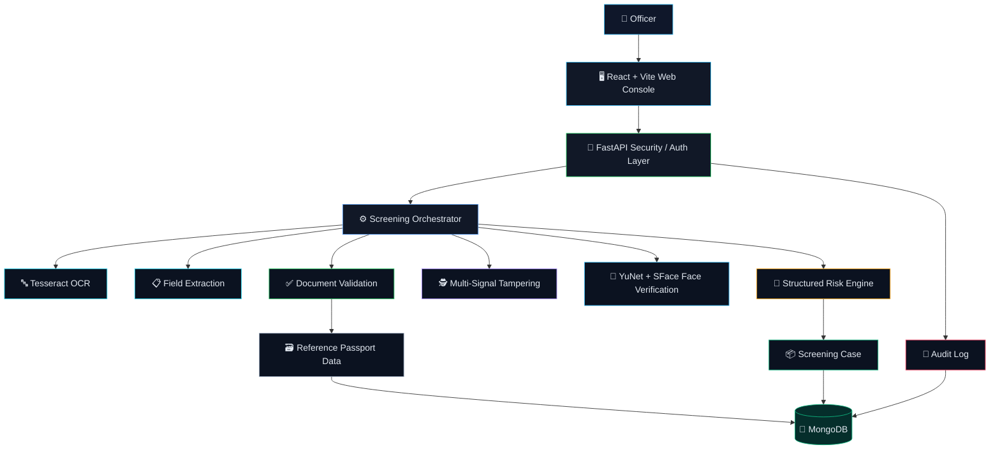
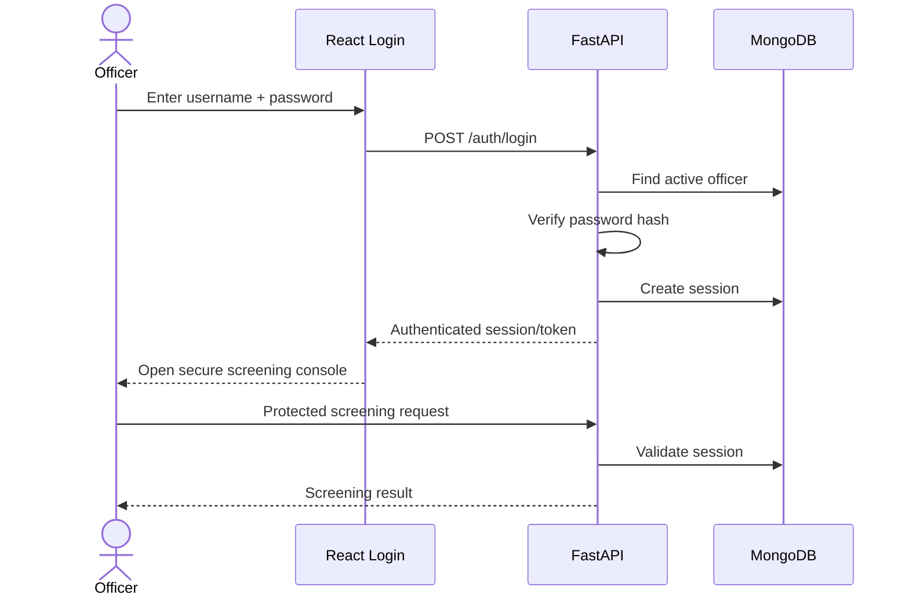

<!--
VERIGUARD — Single-file GitHub README
Everything below is intentionally self-contained: no local docs/assets folder is required.
Visual architecture/workflow diagrams use Mermaid, which GitHub renders directly.
<p align="center">
🛡️ VERIGUARD
AI-Based Fake Identity & Document Screening System
SIH26188 • Smart India Hackathon
<br/>


</p>
<p align="center">
  <b>One secure officer console for OCR, document validation, tampering analysis, printed-face verification, explainable risk assessment and auditability.</b>
</p>
---
✨ Project at a Glance
VERIGUARD is a web-based security screening prototype designed for SIH26188 — AI-Based Fake Identity & Document Screening System.
The main idea is simple:
> **Upload a document → extract evidence → validate it → inspect integrity → compare the person with the printed document face → calculate risk → preserve the screening trail.**
The prototype is intentionally built as decision support for screening officers, not as a claim that AI alone can prove fraud.
Core capabilities
Capability	What VERIGUARD does
🔐 Officer authentication	Pre-created officer credentials, hashed passwords, sessions and protected APIs
📄 OCR	Tesseract-based text extraction
🧾 Field extraction	Name, DOB, document ID/number, validity, nationality, gender and document-specific fields
✅ Validation	Document-specific format, dates, expiry and consistency checks
🕵️ Tampering analysis	ELA + local-region + text-region + photo-region + metadata signals
👤 Face verification	Person photo ↔ printed face on the uploaded document
🧠 Risk engine	Structured score, level, decision and explainable factors
🗄️ MongoDB	Cases, officers, sessions, references, audit logs and case counters
📜 Auditability	Officer-linked screening history and security events
📊 Operations UI	Dashboard, screening, history, analytics, reports, settings and help
---
🎯 SIH Problem Alignment
The prototype is structured around identity and travel-document screening scenarios such as:
Passport • Visa • National ID / Identity Card • Driving Licence • Permits / Other identity documents
Problem → Solution mapping
Screening requirement	VERIGUARD solution
Reduce manual verification time	Automated OCR + validation + image analysis
Detect suspicious documents	Multi-signal tampering/integrity analysis
Standardize screening	Structured case schema + risk scoring
Verify identity visually	YuNet face detection + SFace recognition
Keep evidence traceable	MongoDB case records + audit logs
Protect officer access	Authentication + sessions + protected APIs
Produce an operational result	Risk level + decision + findings + case ID
---
💡 Proposed Solution
VERIGUARD separates the system into two complementary security layers.
1. 🔐 System Security Layer
This answers:
> **“Who is allowed to operate the screening console?”**
Officer accounts are pre-created in MongoDB. Passwords are stored as derived hashes, login creates an authenticated session, protected endpoints reject unauthenticated requests, logout ends access, and security/screening events can be recorded.
2. 🔎 Evidence Screening Layer
This answers:
> **“What evidence does the uploaded document provide, and how suspicious is it?”**
```text
Authenticated Officer
        │
        ▼
Secure Upload
Document + Optional Person Photo
        │
        ▼
OCR + Field Extraction
        │
        ▼
Document Validation
        │
        ├──────────────► Reference Verification
        │
        ▼
Integrity / Tampering Analysis
        │
        ▼
Person ↔ Printed Document Face Verification
        │
        ▼
Structured Risk Assessment
        │
        ▼
Case Record + Audit Trail
```
---
🧩 System Architecture

---
🔄 End-to-End Screening Workflow

---
🔬 Core Intelligence Modules
01 — OCR & Field Extraction
Tesseract OCR converts the uploaded document image into text.
The extraction layer is designed to identify:
Full name
Date of birth
Document ID / document number
Validity / expiry
Nationality
Gender
Passport-specific fields
Visa-specific fields
The field-extraction service contains document-specific parsing helpers so that the raw OCR text can become structured JSON instead of remaining only as plain text.
OCR output idea
```json
{
  "full_name": "SHIVAM SINGH",
  "dob": "17 Nov, 2004",
  "document_id": "24AI0321",
  "validity": "2024-2027",
  "nationality": "INDIAN",
  "gender": "M"
}
```
---
02 — Document Validation
Validation combines OCR-derived fields with document rules.
Examples of checks:
Document type recognition
Number / identifier format
Date parsing
Future DOB detection
Expiry state
Start date vs end date
Nationality / country consistency
Required-field presence
Document-specific patterns
Typical validation outcomes:
```text
VALID
INVALID
EXPIRED
NOT_YET_VALID
REVIEW
UNKNOWN
```
---
03 — Reference Database Verification
For passport-oriented screening, the prototype supports comparison against a MongoDB reference collection.
Possible outcomes:
```text
MATCH
PARTIAL_MATCH
MISMATCH
NO_MATCH
```
The reference dataset is used as synthetic reference data for the prototype, not as proof that a real individual is genuine.
---
04 — Tampering / Integrity Analysis
VERIGUARD does not rely on a single ELA number.
Instead, the prototype combines multiple signals:
Global analysis
Error Level Analysis (ELA)
Overall image-quality indicators
Local analysis
4×4 region inspection
Laplacian / sharpness variation
Edge-density variation
Robust median / MAD outlier analysis
Targeted analysis
Text-region ELA inconsistency
Photo-region comparison with surrounding regions
Metadata / editing software indicators
Output
The result can expose:
```text
Global ELA
Local Regions
Text Region
Photo Region
Metadata
Confidence
Evidence Count
Suspicious Regions
Tampering Classification
```
Example classification logic:
```text
HIGH_RISK
REVIEW
LOW_RISK
NORMAL
```
> ⚠️ A tampering flag is a screening signal, not automatic proof of fraud. Proper deployment requires calibration against a representative labeled dataset.
---
05 — Face Verification
Goal
The intended biometric comparison is:
> **Person photo ↔ face printed on the same uploaded document**
Not random database faces.
Vision pipeline
```text
Document Image
      │
      ▼
   YuNet Face Detection
      │
      ▼
Printed Document Face
      │
      └──────────────┐
                     │
Person Photo        │
      │              │
      ▼              │
YuNet Face Detection │
      │              │
      ▼              │
Primary Face Crop ───┘
          │
          ▼
       SFace
          │
          ▼
Cosine Similarity
          │
          ▼
MATCH / PARTIAL / MISMATCH
```
Robustness work included in the prototype
Camera capture
Uploaded person photo fallback
Blue face-guide UI
Tighter central camera crop
Document-face detection
Person-face detection
Centered primary-person-face selection
Multiple-background-face handling
SFace feature comparison
Similarity score
Face-result contribution to risk
---
🧠 Structured Risk Engine
The risk engine is designed to combine multiple signals rather than letting one detector alone decide the final outcome.
Main contributors
```text
Document Validation
        +
Reference Verification
        +
Face Verification
        +
Tampering Evidence
        +
OCR / Field Quality
        +
Image Quality
        +
Document-specific Policy Rules
        ↓
   Overall Risk Score
```
Risk bands used by the structured engine
Score	Category	Example decision
80–100	🔴 CRITICAL	REJECT / ESCALATE
60–79	🟠 HIGH	MANUAL REVIEW
35–59	🟡 MEDIUM	MANUAL REVIEW
20–34	🔵 LOW-RISK REVIEW	SECONDARY CHECK
0–19	🟢 LOW	PASS / CLEAR
Explainability
A screening result is intended to include the underlying factors instead of only showing:
```text
Risk = 67
```
It can instead explain:
```text
Risk Score: 67
Level: HIGH

Reasons:
• Validation concern
• Face mismatch contribution
• Suspicious local image regions
• Reference record mismatch
```
> Some demo-specific rules may intentionally raise the risk level for a scenario. Such rules are business / operational policies, not standalone evidence of fraud.
---
🔐 Officer Authentication & Security
The project uses an outer authentication layer around the existing screening functionality.
Authentication flow

Security controls implemented
Pre-created officer accounts
PBKDF2-HMAC-SHA256 password hashing
Current implementation uses 310,000 PBKDF2 iterations
Auth session storage in MongoDB
Session TTL support
Protected screening APIs
Logout
Officer-linked screening records
Login success/failure audit events
Screening completion audit events
Upload type/size validation
Filename sanitization
Malicious/decompression-bomb protection
MIME / actual-format checks
Public endpoints
```text
GET  /
GET  /health
POST /auth/login
```
Protected endpoints
```text
GET  /auth/me
POST /auth/logout
POST /upload
GET  /history
GET  /analytics
GET  /reports
GET  /audit-logs
```
---
🗄️ MongoDB Architecture
Database:
```text
veriguard
```
Collections:
```text
veriguard
├── reference_passports
├── screening_cases
├── dataset_metadata
├── officers
├── auth_sessions
├── audit_logs
└── case_counters
```
What each collection stores
Collection	Purpose
`reference_passports`	Synthetic passport reference records
`screening_cases`	Complete case-level screening results
`dataset_metadata`	Imported dataset metadata
`officers`	Pre-created officer accounts and profile data
`auth_sessions`	Authenticated sessions with expiry
`audit_logs`	Security + screening events
`case_counters`	Atomic case-ID generation
Case ID design
Example:
```text
VG-20260911-000001
VG-20260911-000002
VG-20260911-000003
```
The counter-based generation is designed to keep case IDs unique and officer-friendly.
---
📚 Reference Dataset
The prototype uses:
Hugging Face dataset: `ud-synthetic/indian-passports`
Source:
https://huggingface.co/datasets/ud-synthetic/indian-passports
The prototype importer currently works with the available synthetic passport records.
Important data note
The dataset is synthetic / fictional and must not be presented as a real-person biometric or identity database.
---
🖥️ Prototype UI
The prototype is designed as an officer-first security console.
Main screens
```text
┌──────────────────────────────────────────────────────┐
│ 🛡️ VERIGUARD                                         │
├───────────────┬──────────────────────────────────────┤
│ Dashboard     │                                      │
│ Screening     │        Security Operations Console   │
│ History       │                                      │
│ Analytics     │        Upload → Analyze → Review     │
│ Reports       │                                      │
│ Settings      │                                      │
│ Audit Trail   │                                      │
└───────────────┴──────────────────────────────────────┘
```
Screening result concept
```text
┌─────────────────────────────────────────────────────┐
│ DOCUMENT RESULT                                     │
├─────────────────────────────────────────────────────┤
│ Document Type     Student ID                         │
│ Full Name         Shivam Singh                       │
│ DOB               17 Nov, 2004                      │
│ Document ID       24AI0321                          │
│ Validity          2024–2027                         │
│ Validation        VALID                             │
│                                                     │
│ FACE VERIFICATION                                   │
│ MATCH                 Similarity 75.7/100           │
│ Document Face         DETECTED                       │
│ Person Face           DETECTED                       │
│                                                     │
│ RISK SCORE                    35 / 100              │
│                                                     │
│ OCR            ✅ COMPLETED                         │
│ Validation     ✅ VALID                             │
│ ELA            ◐ REVIEW                             │
│ Metadata       ◐ LIMITED                            │
└─────────────────────────────────────────────────────┘
```
> The exact displayed values depend on the uploaded document and test scenario.
---
🧰 Technology Stack
Layer	Technology	Purpose
Frontend	React	Officer-facing web application
Tooling	Vite	Fast frontend development / bundling
Styling	CSS	Dark/light security-console UI
Backend	FastAPI	REST APIs + screening orchestration
Language	Python	Backend + AI pipeline
OCR	Tesseract / pytesseract	Text extraction
Image processing	OpenCV	Image analysis
Face detection	YuNet	Face detection
Face recognition	SFace	Feature extraction + similarity
Numerical processing	NumPy	Image/score calculations
Database	MongoDB	Cases, auth, references, audit
Python DB driver	PyMongo	MongoDB integration
Config	python-dotenv	Environment configuration
Dataset tooling	Hugging Face datasets / hub	Reference dataset import
API server	Uvicorn	FastAPI serving
Password security	PBKDF2-HMAC-SHA256	Password hashing
---
📁 Project Structure
Recommended runtime structure:
```text
fake-document-screening/
│
├── backend/
│   ├── main.py
│   ├── db.py
│   ├── field_extraction_service.py
│   ├── import_dataset.py
│   ├── seed_officer.py
│   ├── models/
│   │   └── face/
│   └── venv/
│
├── frontend/
│   ├── src/
│   │   ├── App.jsx
│   │   └── App.css
│   ├── public/
│   ├── package.json
│   ├── package-lock.json
│   ├── index.html
│   └── vite.config.js
│
├── .gitignore
├── package-lock.json
└── README.md
```
Important
Development caches / environments should stay ignored:
```text
backend/venv/
backend/__pycache__/
backend/models/
frontend/node_modules/
frontend/dist/
.env
*.pyc
*.pyo
*.log
```
---
🚀 Local Setup
1. Clone the repository
```bash
git clone https://github.com/prakhar2865/MARK-01.git
cd MARK-01
```
Or open the existing project directly.
---
2. Backend
```bash
cd backend
python -m venv venv
source venv/Scripts/activate
```
On Windows Git Bash:
```bash
source venv/Scripts/activate
```
Install packages:
```bash
pip install fastapi uvicorn python-multipart
pip install pytesseract pillow
pip install opencv-contrib-python==4.10.0.84
pip install numpy
pip install pymongo dnspython
pip install python-dotenv
pip install datasets requests huggingface_hub
```
Run:
```bash
uvicorn main:app --reload
```
Backend:
```text
http://127.0.0.1:8000
```
---
3. Frontend
Open another terminal:
```bash
cd frontend
npm install
npm run dev
```
Open the Vite URL shown in the terminal.
---
🗃️ MongoDB Setup
Default local MongoDB connection:
```text
mongodb://localhost:27017
```
Database:
```text
veriguard
```
Make sure MongoDB service is running before starting the backend.
Expected health response:
```json
{
  "status": "healthy",
  "mongodb": "connected",
  "screening_cases": 10
}
```
The exact case count will naturally differ on another machine.
---
👮 Officer Seed / Login
Officer credentials are intended to exist in MongoDB before normal use.
The seed helper is:
```text
backend/seed_officer.py
```
The design uses:
```text
Officer
  ↓
Username + Password
  ↓
PBKDF2 Hash Verification
  ↓
Session Creation
  ↓
Protected Console
```
There is no public officer self-registration flow in the intended prototype architecture.
---
🧪 Demo Scenarios
For SIH presentation, prepare a small controlled scenario set.
Scenario A — Clean / low-risk document
Expected idea:
```text
OCR              ✅
Validation       ✅ VALID
Face             ✅ MATCH
Tampering        NORMAL / REVIEW
Risk             LOW
Decision          PASS / CLEAR
```
Scenario B — Driving Licence + person verification
A demo-specific policy can intentionally push attention into a higher review band.
Example:
```text
Document Type      Driving Licence
Person Photo       Supplied
Risk               HIGH / Manual Review
```
This is a demo/policy rule, not a claim that every driving licence with a person photo is fraudulent.
Scenario C — Face mismatch
```text
Document Face      DETECTED
Person Face        DETECTED
Similarity         LOW
Face Result        MISMATCH
Risk Contribution  HIGH
Decision           MANUAL REVIEW / ESCALATE
```
Scenario D — Tampered image
```text
Global ELA         REVIEW
Local Regions      SUSPICIOUS
Text Region        SUSPICIOUS
Photo Region       REVIEW
Metadata           LIMITED
Risk               ELEVATED
Decision           MANUAL REVIEW
```
---
🧪 Testing Checklist
Authentication
[ ] Correct login
[ ] Wrong password
[ ] Unknown officer
[ ] Inactive officer
[ ] Session expiry
[ ] Logout
[ ] Protected endpoint without session
OCR
[ ] Clear document
[ ] Low-quality document
[ ] Different document layouts
[ ] Name extraction
[ ] DOB extraction
[ ] ID extraction
[ ] Validity extraction
[ ] Nationality / gender extraction
[ ] Passport / visa fields
Validation
[ ] Valid document
[ ] Invalid number
[ ] Expired document
[ ] Future DOB
[ ] Missing field
[ ] Unsupported pattern
Tampering
[ ] Clean image
[ ] Compression-only image
[ ] Text edit
[ ] Photo replacement
[ ] Local paste
[ ] Metadata variation
[ ] False-positive analysis
Face
[ ] MATCH
[ ] MISMATCH
[ ] NO_FACE
[ ] Low-light
[ ] Blur
[ ] Multiple background faces
[ ] Different camera distances
[ ] Uploaded photo fallback
Database / E2E
[ ] MongoDB available
[ ] MongoDB unavailable
[ ] Case ID uniqueness
[ ] History entry
[ ] Officer linked to case
[ ] Audit entry
[ ] Analytics response
[ ] Report response
---
📊 Current Implementation Status
✅ Implemented
React + Vite frontend
FastAPI backend
MongoDB integration
CORS configuration
Officer login UI
MongoDB officer credentials
Password hashing
Session/token system
Logout
Protected APIs
Officer profile
Audit trail
Secure document upload
File type / size validation
Tesseract OCR
Name / DOB / ID / validity extraction
Basic document validation
Reference passport collection
Expiry validation
Document-number format validation
ELA analysis
Metadata analysis
Text consistency analysis
Image-quality analysis
Advanced multi-signal tampering pipeline
Local-region analysis
Text-region analysis
Photo-region analysis
Evidence count / findings
YuNet + SFace face pipeline
Camera capture
Person-photo upload fallback
Similarity score
Structured risk scoring
History
Analytics
Reports page
Settings
Dark / light theme
Security hardening basics
Case-ID generation
🟡 Implemented but needs broader testing
Passport-specific OCR fields
Visa-specific OCR fields
Nationality improvement
Gender improvement
Passport-number improvement
Visa number / type / entry / stay validation
YuNet/SFace robustness across many real-world conditions
Structured Risk Engine v1 calibration
⏳ Next engineering improvements
Password change
Session invalidation improvements
Photo replacement detection calibration
Text manipulation calibration
Stamp / signature forgery analysis
Better metadata detection
Tampering heatmap
Real tampered-document calibration
False-positive testing
Risk category testing
Explainable risk reason testing
Case timeline
Audit integration refinements
Risk analytics charts
Individual case PDF reports
Loading / empty / error states
Rate limiting
Production security configuration
Full end-to-end and performance test suite
SIH demo package, diagrams and presentation
---
🛡️ Cybersecurity Design
The system combines application security with evidence traceability.
Application security
```text
Password hashing
      +
Authenticated sessions
      +
Protected APIs
      +
Upload validation
      +
Filename sanitization
      +
Decompression-bomb protection
      +
MIME / format verification
      ↓
Secure screening application
```
Auditability
```text
Officer
  ↓
Login Event
  ↓
Screening Event
  ↓
Case ID
  ↓
Stored Evidence / Result
  ↓
Audit Trail
```
---
⛓️ Blockchain Extension — Proposed
Current prototype does not contain a live blockchain deployment.
A practical future design would not put the document or face image on-chain.
Instead:
```text
Document / Result
      ↓
SHA-256 Hash
      ↓
Blockchain / Immutable Ledger
```
MongoDB continues to store the operational case.
The chain stores only an integrity proof such as:
```text
Case ID
Result Hash
Timestamp
Officer / System Reference
```
SIH-friendly explanation
> **Cybersecurity protects the screening system, while blockchain can provide an immutable audit and integrity layer for screening evidence.**
This keeps sensitive identity data off-chain while giving later users a way to verify whether the screening record was altered.
---
🧭 Future Vision

```mermaid
flowchart LR
    A["Prototype"] --> B["Better Calibration"]
    B --> C["More Document Types"]
    C --> D["Improved Tampering Models"]
    D --> E["Liveness / Anti-Spoofing"]
    E --> F["Stronger Analytics"]
    F --> G["Signed PDF Reports"]
    G --> H["Immutable Integrity Layer"]

    style A fill:#0f172a,stroke:#38bdf8,color:#e2e8f0
    style B fill:#111827,stroke:#60a5fa,color:#e2e8f0
    style C fill:#111827,stroke:#60a5fa,color:#e2e8f0
    style D fill:#111827,stroke:#a78bfa,color:#e2e8f0
    style E fill:#111827,stroke:#22d3ee,color:#e2e8f0
    style F fill:#111827,stroke:#22c55e,color:#e2e8f0
    style G fill:#111827,stroke:#f59e0b,color:#e2e8f0
    style H fill:#111827,stroke:#10b981,color:#e2e8f0
```

---
🏁 Suggested SIH Demo Flow
Use this exact presentation sequence for a clean live demo:
```text
1. Officer Login
      ↓
2. Dashboard
      ↓
3. Upload a sample document
      ↓
4. OCR extraction
      ↓
5. Validation result
      ↓
6. Tampering / integrity signals
      ↓
7. Capture person face
      ↓
8. Face MATCH / MISMATCH
      ↓
9. Risk score + reasons
      ↓
10. Case ID
      ↓
11. Screening History
      ↓
12. Audit Trail
```
Best demo message
> **“VERIGUARD does not replace an officer. It gives the officer a standardized, explainable and auditable evidence package so suspicious documents can be reviewed faster and more consistently.”**
---
📌 Important Engineering Notes
The system is a prototype, not a certified identity-verification product.
AI outputs are decision-support signals and require human review in high-impact deployment.
Synthetic passport data is used for the current reference-data demonstration.
Real deployment requires security review, privacy controls, representative labeled datasets, legal/compliance review and threshold calibration.
Face verification quality depends on image quality, pose, illumination, blur, occlusion and the quality of the printed document photo.
Tampering analysis can produce false positives; calibration is mandatory before production use.
---
🔗 Repository
GitHub:  
https://github.com/prakhar2865/MARK-01
SIH Problem:  
`SIH26188 — AI-Based Fake Identity & Document Screening System`
---
👥 Team / Presentation
Project: VERIGUARD  
Domain: AI + Computer Vision + Document Security + Cybersecurity  
Platform: Web Application  
Target User: Security / screening officer
---
<p align="center">
🛡️ VERIFY. ANALYZE. ASSESS. AUDIT.
VERIGUARD  
AI-assisted identity and document screening for security operations.
</p>
