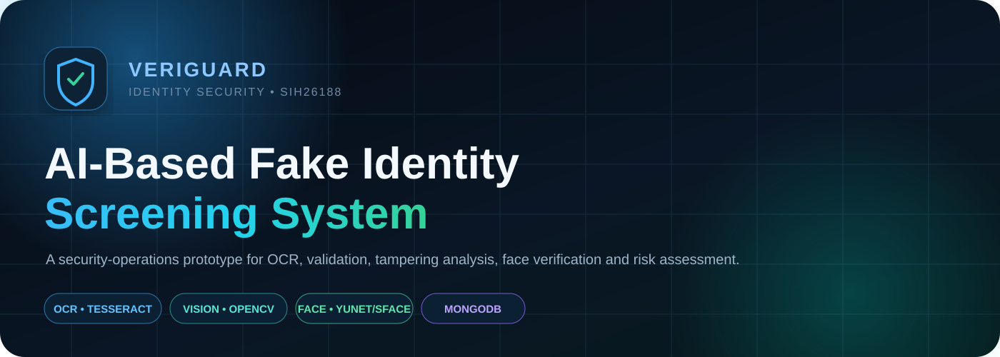
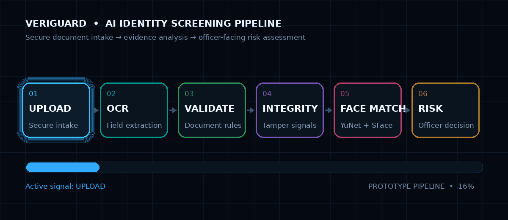
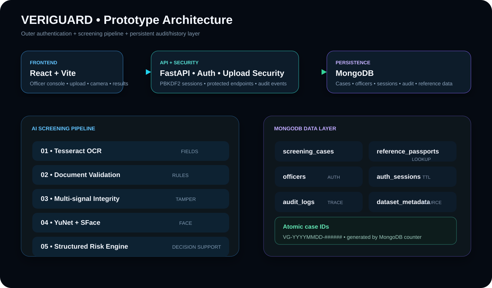
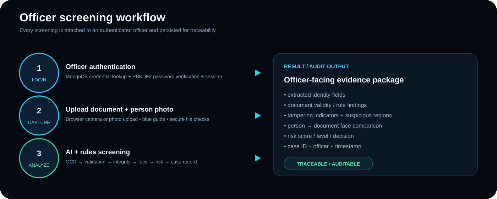
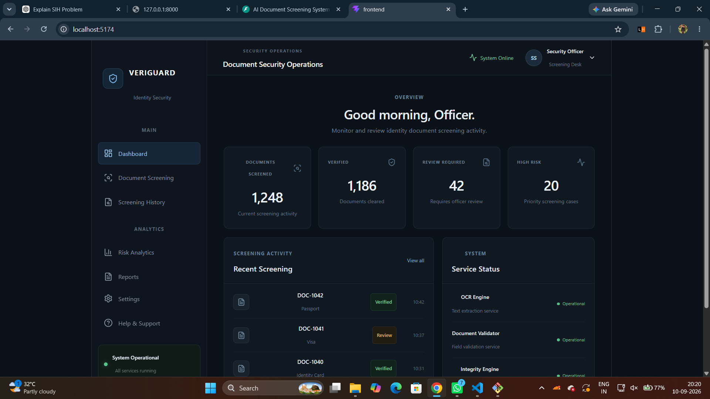
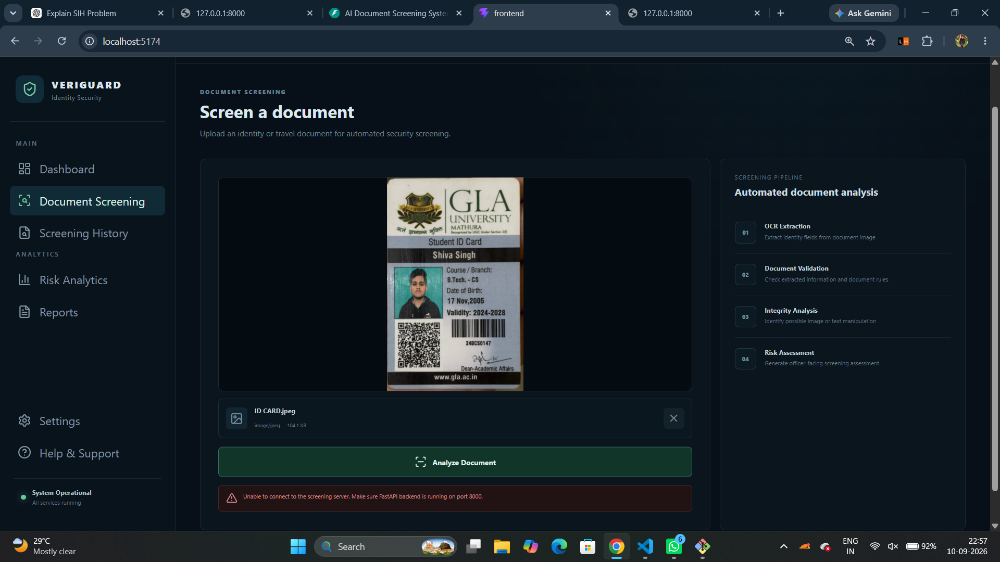
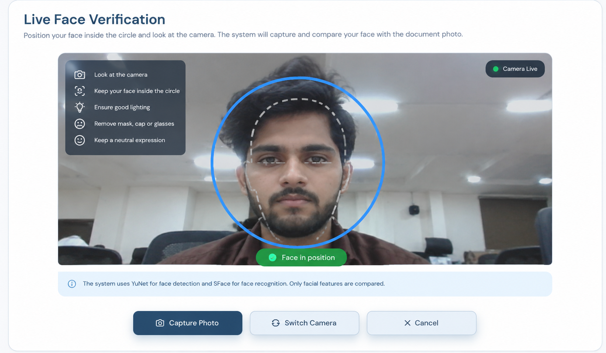
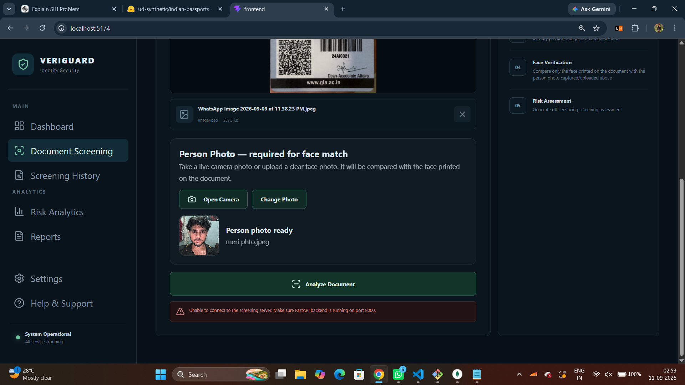
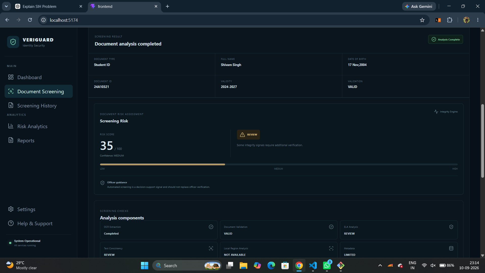
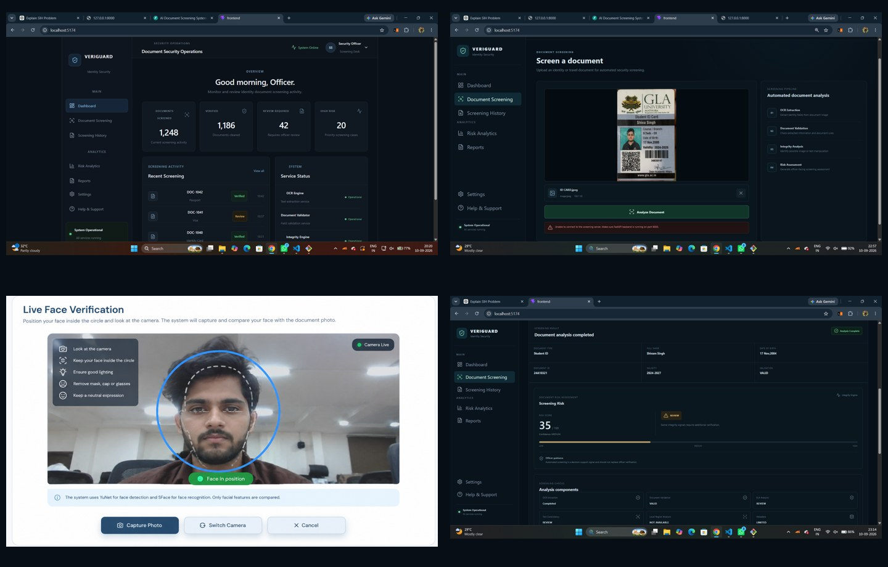

<p align="center"></p>
<p align="center">    </p>
<p align="center"><b>AI-assisted identity and document screening for security officers.</b><br/>OCR • document validation • tampering analysis • printed-face verification • risk assessment • audit trail</p>

---

## 🛡️ What is VERIGUARD?

**VERIGUARD** is a web-based prototype for the **SIH26188 — AI-Based Fake Identity & Document Screening System** problem statement. The system is designed around one operational goal:

> **Turn a raw identity/travel document into a structured, explainable, officer-facing screening result.**

The prototype brings document intelligence, computer vision, authentication and case traceability into one security-operations console.

### The core screening flow

**Document → OCR → Field extraction → Validation → Integrity/Tampering signals → Face verification → Risk assessment → Case record → Audit trail**



## 🎯 SIH problem alignment

The solution is structured for screening of documents such as Passport, Visa, National ID / identity card, Driving Licence and permits or other identity/travel documents.

| Requirement | VERIGUARD approach |
|---|---|
| OCR extraction | **Tesseract OCR** + document-specific field parsing |
| Document validation | Rule-based field, date, format and document-type validation |
| Forgery / tampering | Multi-signal image integrity analysis |
| Face verification | **YuNet** detection + **SFace** recognition |
| Risk assessment | Structured scoring with explainable factors |
| Standardized screening | Consistent result schema across cases |
| Digital trail | MongoDB case history + audit logs + officer identity |
| Access security | Authenticated officer console + protected APIs |

## 💡 Proposed solution

VERIGUARD separates the problem into two security layers.

### 1. System security layer

This protects **who is allowed to operate the screening system**. Officer credentials are pre-created in MongoDB; passwords are hashed; login creates a session; protected APIs reject unauthenticated requests; and screening/authentication events can be written to the audit trail.

### 2. Evidence screening layer

This evaluates **what was uploaded** and produces structured evidence.

```text
Authenticated Officer
        ↓
Secure Upload: Document + Person Photo
        ↓
OCR + Field Extraction
        ↓
Document Validation
        ↓
Integrity / Tampering Analysis
        ↓
Person ↔ Printed Document Face Verification
        ↓
Structured Risk Assessment
        ↓
MongoDB Case + Audit Trail
```

## 🏗️ Prototype architecture



### Major components

**Frontend — React + Vite:** login, dashboard, screening, live camera capture, person-photo upload, results, history, analytics, reports, settings/help and dark/light UI.

**Backend — FastAPI:** authentication, protected APIs, secure uploads, OCR orchestration, field extraction, validation, tampering analysis, YuNet + SFace verification, risk engine, MongoDB persistence and audit logging.

**Database — MongoDB:** officer records, sessions, screening cases, reference data, audit events, dataset metadata and atomic case-ID counters.

## 🔬 AI / analysis pipeline

### 01 — OCR extraction

Tesseract OCR converts the document image into machine-readable text. Document-specific parsers attempt to extract **name, DOB, document ID/number, validity/expiry, nationality, gender, passport fields and visa fields**.

### 02 — Document validation

The validation layer can check document type, number format, field presence, date parsing, expiry state, future DOB and nationality consistency. Visa-field checks are supported where those fields are detected.

### 03 — Tampering / integrity analysis

The prototype deliberately uses **multiple signals** instead of one image statistic alone:

- Global ELA
- Local 4×4 region analysis
- Laplacian / sharpness variation
- Edge-density variation
- Robust median / MAD outliers
- Text-region inconsistency
- Photo-region comparison against surrounding image texture
- Metadata / editing-software indicators
- Image-quality checks

Outputs can include component scores, suspicious regions, evidence count, confidence and an overall integrity classification.

> A tampering flag is a screening signal, not proof of fraud. Real deployment needs calibration on a representative labeled corpus.

### 04 — Face verification

The prototype uses **YuNet** for face detection and **SFace** for face features and similarity.

The intended comparison is deliberately narrow:

> **Captured / uploaded person photo ↔ face printed on the same uploaded document.**

The browser camera UI uses a blue guide and tighter central capture. The backend selects the primary person face before recognition so incidental background faces do not become the main comparison target.

Typical outcomes: `MATCH`, `PARTIAL`, `MISMATCH`, `NO_FACE` and quality/detection review states.

### 05 — Risk assessment

The structured engine combines document validation, reference verification, face verification, tampering evidence, image quality and OCR/field quality with document-specific policy hooks.

| Score | Level | Typical decision |
|---:|---|---|
| 80–100 | **CRITICAL** | REJECT / ESCALATE |
| 60–79 | **HIGH** | MANUAL REVIEW |
| 35–59 | **MEDIUM** | MANUAL REVIEW |
| 20–34 | **LOW-RISK REVIEW** | SECONDARY CHECK |
| 0–19 | **LOW** | PASS / CLEAR |

Demo-specific policy rules can intentionally raise attention levels for particular screening scenarios. Those rules are **decision-support policies**, not automatic proof of fraud.

## 👤 Officer authentication & security



The prototype includes pre-created officer accounts, PBKDF2-HMAC-SHA256 password hashing, 310,000 PBKDF2 iterations in the current implementation, MongoDB session records, session TTL support, protected screening/history/analytics/reports/audit APIs, logout, audit events, officer-linked case records and upload hardening.

### Public vs protected API surface

| Endpoint | Access |
|---|---|
| `GET /` | Public health/info |
| `GET /health` | Public health check |
| `POST /auth/login` | Public login |
| `GET /auth/me` | Authenticated |
| `POST /auth/logout` | Authenticated |
| `POST /upload` | Authenticated |
| `GET /history` | Authenticated |
| `GET /analytics` | Authenticated |
| `GET /reports` | Authenticated |
| `GET /audit-logs` | Authenticated |

## 🗄️ MongoDB data model

```text
veriguard
├── reference_passports
├── screening_cases
├── dataset_metadata
├── officers
├── auth_sessions
├── audit_logs
└── case_counters
```

MongoDB suits the prototype because screening evidence is naturally document-shaped: extracted OCR fields, validation findings, tampering evidence, face results, risk factors, officer metadata and audit information can vary by document type.

Case IDs can be generated atomically with patterns such as:

```text
VG-20260911-000001
VG-20260911-000002
VG-20260911-000003
```

## 📚 Reference dataset

The prototype uses the Hugging Face **`ud-synthetic/indian-passports`** dataset as synthetic passport reference data:

**https://huggingface.co/datasets/ud-synthetic/indian-passports**

This dataset is synthetic / fictional and should not be described as a real-person biometric or identity database.

## 🖥️ Prototype screens

### Dashboard


### Document screening


### Live face verification


### Person photo workflow


### Screening result and risk assessment


### Quick showcase


## 📁 Recommended project structure

```text
fake-document-screening/
│
├── backend/
│   ├── main.py
│   ├── db.py
│   ├── field_extraction_service.py
│   ├── import_dataset.py
│   ├── seed_officer.py
│   ├── models/
│   │   └── face/
│   └── venv/
│
├── frontend/
│   ├── src/
│   │   ├── App.jsx
│   │   └── App.css
│   ├── public/
│   ├── package.json
│   ├── index.html
│   └── vite.config.js
│
├── .gitignore
├── package-lock.json
└── README.md
```

> Local development backups may exist. They are not part of the runtime architecture.

## 🧰 Tech stack

| Layer | Technology | Purpose |
|---|---|---|
| UI | **React** | Officer-facing web console |
| Build tooling | **Vite** | Frontend development / bundling |
| Styling | **CSS** | Security-operations interface + themes |
| API | **FastAPI** | Backend API and orchestration |
| Server | **Uvicorn** | ASGI server |
| OCR | **Tesseract / pytesseract** | Text extraction |
| Image processing | **Pillow** | Image IO, EXIF and image statistics |
| Computer vision | **OpenCV** | Image analysis + face stack |
| Face detection | **YuNet** | Face localization |
| Face recognition | **SFace** | Feature extraction + similarity |
| Database | **MongoDB / PyMongo** | Cases, reference data, officers, sessions, audit |
| Security | **PBKDF2-HMAC-SHA256** | Officer password hashing |
| Client capture | **Browser MediaDevices API** | Live photo capture |
| Dataset | **Hugging Face synthetic passport data** | Reference/demo records |

## ⚙️ Local setup

### Prerequisites

- Python 3.x
- Node.js + npm
- MongoDB Community Server / service
- Tesseract OCR
- Modern Chromium/Firefox browser for camera capture

Default development services:

```text
Frontend → http://localhost:5173
Backend  → http://127.0.0.1:8000
MongoDB  → mongodb://localhost:27017
```

### Backend

```bash
cd ~/fake-document-screening/backend
source venv/Scripts/activate
python -m py_compile main.py
python -m uvicorn main:app --reload
```

### Frontend

```bash
cd ~/fake-document-screening/frontend
npm install
npm run dev
```

### Tesseract on Windows

Current development path:

```text
C:\Program Files\Tesseract-OCR\tesseract.exe
```

Update the backend path if Tesseract is installed elsewhere.

### Officer seeding

```bash
cd ~/fake-document-screening/backend
source venv/Scripts/activate
python seed_officer.py
```

Use the prompted officer details and password. **Never commit real credentials.**

## 🧪 Prototype demo scenarios

| Scenario | Expected story |
|---|---|
| Clean Student ID + matching face | OCR succeeds, document validates, face matches, low-risk / clear path |
| Driving Licence + verification photo | Face/document checks run and attention can be raised by policy |
| Expired document | Date rules contribute to validation and risk |
| Tampered document | Integrity engine surfaces abnormal regions / metadata indicators |
| Wrong person photo | Face similarity drops and risk can increase |
| Passport reference mismatch | MongoDB reference lookup adds mismatch evidence |
| Invalid login | Access is denied and authentication activity can be logged |

### Face-test rule

```text
Captured / uploaded person face
                ↕
Printed face on the SAME uploaded document
```

## 📊 Risk engine philosophy

The risk engine is designed to help an officer prioritize attention, not replace human verification. A production system should add labeled genuine/forged datasets, document-type calibration, false-positive/false-negative evaluation, ROC/PR analysis for face verification, image-quality benchmarks, adversarial testing and independent security review.

## 🔐 Security design notes

### Implemented in the prototype

- Password hashing
- Authenticated sessions
- Protected APIs
- Session TTL support
- Audit logging
- Upload size/type/content checks
- Filename sanitization
- Image parsing safeguards
- MongoDB indexes for core queries
- Sanitized case responses that avoid leaking sensitive token/password fields

### Recommended production hardening

- Rate limiting
- HTTPS everywhere
- Strong secret management / vault
- Key rotation
- Reverse proxy / WAF
- Fine-grained RBAC
- Security-event alerting
- Backup / retention enforcement
- Model provenance and version pinning
- Formal penetration testing

## ⛓️ Blockchain-ready extension — proposed

The meaningful place for blockchain is the **integrity layer**, not storing raw identity documents. A future extension could anchor a cryptographic proof such as:

```text
SHA-256(document) + screening_result_hash + case_id + timestamp
```

on an immutable ledger while keeping detailed evidence in secure storage.

> **Cybersecurity protects the screening system; blockchain can provide an immutable integrity/audit layer for screening evidence.**

The current prototype does **not** claim to contain a production blockchain network.

## 🧭 Current implementation status

### Working / integrated prototype areas

- React + Vite frontend
- FastAPI backend
- MongoDB integration
- Officer authentication and password hashing
- Session system and protected screening endpoints
- OCR and core field extraction
- Document validation
- MongoDB passport reference verification
- Multi-signal tampering analysis
- YuNet face detection + SFace recognition
- Person-photo capture / upload
- Structured risk assessment
- Screening history
- Analytics endpoint / dashboard data
- Reports endpoint / UI
- Audit trail
- Dark/light UI
- Upload security hardening

### Still requiring formal testing / calibration

- Passport-specific extraction across diverse layouts
- Visa-field extraction across varied visa formats
- Tampering threshold calibration on labeled data
- Stamp/signature forgery analysis
- Heatmap visualization
- False-positive testing
- Rate limiting / production session hardening
- Full load / performance testing
- Production-grade report generation

## 🧪 Testing checklist

```text
[ ] valid document
[ ] expired document
[ ] invalid document number
[ ] missing fields
[ ] tampered document
[ ] clean document
[ ] face MATCH
[ ] face MISMATCH
[ ] no face
[ ] multiple background faces
[ ] low-light / blur
[ ] wrong password
[ ] expired session
[ ] bad file type
[ ] oversized file
[ ] malformed image
[ ] MongoDB unavailable
[ ] complete end-to-end officer flow
```

## 🧩 Why the prototype is SIH-friendly

VERIGUARD is presented as an **operational security console**, not a collection of disconnected AI demos. The evaluator story is simple:

**Authenticate → Screen → Explain → Record → Audit**

That makes the prototype easy to demonstrate while keeping the path to production hardening explicit.

## 📈 Future roadmap

**Phase 1 — Accuracy:** more document templates, better OCR post-processing, calibrated tampering model, face-quality gating and stronger visa parsing.

**Phase 2 — Intelligence:** learned tampering classifier, better template recognition, multilingual OCR, screening-history anomaly detection and officer workload analytics.

**Phase 3 — Security at scale:** RBAC, rate limiting, key management, immutable evidence ledger, secure multi-site deployment and SIEM integration.

## 👥 Project positioning

**VERIGUARD** is a prototype for Smart India Hackathon problem statement **SIH26188**. It is intended as decision-support software for trained officers and should not be presented as an autonomous legal or identity adjudication system.

## 📄 License / usage note

This README describes a hackathon prototype. Replace the license section with the team’s final repository license before public production distribution. The referenced synthetic passport dataset has its own license / terms and should be reviewed before redistribution.

## ⭐ One-line pitch

> **VERIGUARD converts identity-document screening from a manual, fragmented check into a secure, explainable and auditable AI-assisted workflow.**

<p align="center"><br/><b>VERIGUARD — Identity Security, backed by evidence.</b></p>
